# Bringing SGLang to Denglin GPUs
## Running Qwen3.5-35B-A3B-FP8 and Closing the TP4 Latency Gap to vLLM

> *A field report on porting a serving framework to a non-NVIDIA GPU — and a week spent locating three milliseconds.*

**Authors:** SGLang Denglin (DLIN) Enablement Team　·　**Date:** July 2026
**Model:** Qwen3.5-35B-A3B-FP8　·　**Hardware:** Denglin DLIN KS38 (4×)　·　**Baseline:** vLLM 0.21.1

---

## Abstract

We ported SGLang to Denglin (DLIN) GPUs and brought **Qwen3.5-35B-A3B-FP8** — a hybrid linear-attention MoE model with blockwise FP8 quantization — to correct, servable operation. The work proceeded in three phases: establishing correctness against a vLLM reference, recovering throughput by selecting the right DLIN MoE kernel path, and benchmarking TP4 decode latency against vLLM. Under the **unified SDK `sdk-dlop-07-13-20-30`** (the earlier `sdk-0401` was incompatible with this model's GDN kernel and reserved ≈19 GiB of phantom GPU memory), the two engines reach **wall_TPOT parity**: SGLang **26.53 ms/token** versus vLLM **26.82 ms/token** (SGLang marginally faster), with byte-identical coherent output. vLLM still runs a faster GPU forward — **17.61 ms vs SGLang's 20.78 ms**, both directly measured — owing to inter-kernel "glue" fusions (`act_quant`, `rope_kvcache_cat_mla`, norm-glue) generated by `torch.compile`; but its wall advantage is erased by ~3 ms more host overhead under the corrected SDK. The first phase of `torch.compile` integration has landed on DLIN SGLang (commit `21970760c0`). The post documents the measurement methodology in full and is explicit about the claims we revised along the way — **including three overturned in this revision** (an earlier draft located a 3 ms wall gap and attributed it to a `norm_quant` fusion on the dense FP8 linear; both claims are disproven below).

---

## 1. Background

### 1.1 Denglin (DLIN) GPUs

Denglin GPUs are a family of domestic GPGPUs. They are **CUDA-compatible at the programming-model level but ship an entirely separate runtime and operator stack**: there is no cuBLAS, cuDNN, or cuBLASLt, and no prebuilt FlashAttention binary. The software environment consists of

- a custom SDK exposing operator headers (`<dldnn_ext.h>`, `<dlblasLt_ext.h>`),
- **DLEOL**, a JIT-compile virtual machine that translates Triton and an internal IR into GPU fatbins at runtime, and
- a profiling toolchain (`dlpti_tools`, analogous to Nsight) and `dlsmi` (analogous to `nvidia-smi`).

The practical consequence for a serving framework is that every performance-critical operator — FP8 GEMM, grouped MoE, paged attention, RMSNorm — must be sourced from the SDK, JIT-built through DLEOL, or hand-written with the DLIN compiler (`dlcc`). The high-value operators (grouped MoE, linear attention) are fast only through DLEOL-JIT'd `_dl_C.so` ops, and those ops exhibit **context-sensitive compilation**: they select different kernel variants depending on call context.

### 1.2 The model: Qwen3.5-35B-A3B-FP8

This is not a dense Llama-class model. It combines three elements, each demanding a distinct operator stack:

- **MoE routing:** 256 experts, 8 active per token, blockwise FP8 `[128,128]` weights. Each decode step performs a routing decision followed by 8 per-expert FP8 GEMMs.
- **Hybrid attention:** of 40 transformer layers, **30 are GatedDeltaNet (GDN) — a linear, state-space-style attention** — and 10 are standard full attention. Each GDN layer runs a recurrent state update (`dl_recurrent_gated_delta_rule`) in addition to a causal conv1d and gating projections.
- **FP8 quantization:** blockwise `[128,128]` on weights; activation quantization is where most correctness landmines reside on DLIN.

The architecture is summarized in **Figure 1**: every block must map to a DLIN operator that both exists and is fast.



*Figure 1. The 40-layer hybrid stack. Two attention flavors (10 full-attention layers, 30 GatedDeltaNet linear-attention layers) both feed a shared FP8 MoE block. Every block requires a DLIN operator to exist and be fast.*

This is therefore not an "attention-backend swap." It is the assembly of a complete operator stack for a new architecture on a new GPU, followed by making it competitive.

---

## 2. The operator mapping

Before performance, there is existence. Table 1 maps each architectural primitive to the DLIN operator that executes it and the mechanism by which SGLang obtains it. This integration work is the bulk of the effort and is usually invisible in enablement posts.

**Table 1.** Operator integration map.

| Primitive | DLIN operator | How SGLang obtains it | Notes |
|---|---|---|---|
| Decode attention | `_vllm_fa2_C.so` / `paged_decode_attn` | hand-built with `dlcc` | FlashAttention source compiled with the DLIN compiler |
| GDN decode | `_dl_C.dl_recurrent_gated_delta_rule` | dlopen vLLM's `_dl_C.so` | DLEOL-JIT'd; ≈3 ms win |
| GDN prefill | `_dl_C.dl_chunk_gated_delta_rule` | same | `l2norm` applied outside the op |
| FP8 dense linear | `_dl_C.gptq_dlblas_gemmex` | same | FP8 weight + bf16 activation |
| Fused FP8 MoE | `_dl_C.invoke_fused_moe_opt` | same | grouped FP8 GEMM |
| Gemma RMSNorm | `_dl_C.gemma_rms_norm` | same | shared with vLLM |
| Standard RMSNorm | `sgl-kernel` dlcc kernel | built in-tree | — |
| TP all-reduce | NCCL (`pynccl`) | framework | custom all-reduce codegen fails on DLIN |

A load-bearing detail: SGLang does **not** compile `_dl_C.so`. It `dlopen`s the exact shared object that vLLM ships in its virtualenv (`fp8_utils.py::_ensure_dl_C()`). `nm` confirms the two engines call identical symbols. This is the foundation for what we took to be Section 5's central claim — **"SGLang and vLLM execute byte-identical GPU primitives, so the residual latency gap must lie somewhere primitives do not reach."** That claim is half-right and half-wrong: the *symbols* are identical, but vLLM's `torch.compile` fuses some of those primitives away, so vLLM runs a *shorter* kernel sequence. Inferring "identical forward time" from "identical symbols" was the load-bearing error corrected in §5.2/§5.7.

---

## 3. Phase I — Correctness

A first boot produced deterministic garbage: *"the a capital of the capital of…"* where vLLM returned *"Paris."* "Stable but wrong" is harder than "crashes" — it indicates computation that runs, incorrectly. We isolated four independent defects, each with a transferable lesson.

### 3.1 Hardcoded rotary style (the root of all quality symptoms)

SGLang's Qwen3 code hardcoded the rotary variant:

```python
# qwen3_5.py — before
is_neox_style = True
```

That is correct for Qwen2/Qwen3 **text** models, where NeoX rotary halves the head dimension. This model, despite its name, is a **Qwen3-VL multimodal architecture**, and its config carries `rope_parameters.mrope_interleaved: True`. It requires **interleaved** rotary — adjacent dimension pairs rather than halves. Applying NeoX rotates the wrong dimension pairs, corrupting attention everywhere and collapsing output to repetition. The landed fix:

```python
# qwen3_5.py:808 — after
# DL: model has mrope_interleaved=True (Qwen3-VL); needs interleaved rotary
# (is_neox_style=False), not NeoX (True).
is_neox_style = (
    not getattr(config, "rope_parameters", {}).get("mrope_interleaved", False)
)
```

This single boolean was the common cause behind every quality symptom across every configuration we tested. *Lesson:* a model's name can misrepresent its architecture; the rotary flag was nested under `rope_parameters` in `config.json`.

### 3.2 A defensive `.contiguous()` that caused a segfault

The FP8 GEMM path (`quant_type=2`) segfaulted (exit −11). SGLang inserted a defensive `.contiguous()` on the weight; vLLM passes a **non-contiguous** `weight.t()` transpose view directly. The DLIN kernel hardcodes the transposed-view strides; flattening the tensor changes the strides and the kernel walks out of bounds. Removing every `.contiguous()` on this path fixed the crash **and** removed ≈4 ms of TPOT. A "safer-looking" call was the defect.

### 3.3 Custom all-reduce crashes under tensor parallelism

Enabling tensor parallelism crashed in `cross_device_reduce_1stage<bfloat16,2>` with `HC_CUK Error=28`: DLIN codegen cannot produce this custom all-reduce kernel. vLLM runs TP on DLIN over NCCL (`use_custom_allreduce=False`); SGLang uses the same resolution:

```
--disable-custom-all-reduce    # use NCCL, matching vLLM
```

### 3.4 FP8 fused MoE: garbage output (the deep case)

The fused MoE path (`invoke_fused_moe_opt`) produced garbage; the bf16-bmm fallback (dequantize to bf16, `torch.bmm`) returned *"Paris"* — but at 3× the cost. We isolated the cause with a decisive technique: **byte-for-byte tensor diffing against the reference.** We launched vLLM from within the SGLang process (instrumenting the DL op shim), dumped the tensors both engines hand to `invoke_fused_moe_opt`, and compared them.

**Table 2.** Inputs to `invoke_fused_moe_opt`, SGLang vs. vLLM.

| Tensor | SGLang | vLLM |
|---|---|---|
| `w13_weight` | (256,256,2048) fp8, stride (524288,2048,1) | **identical** |
| `w13_scale` | (256,4,16) fp32, stride (64,16,1) | **identical** |
| activation `x` | (M,2048) bf16 | **identical** |
| **output** | garbage | "Paris" |

Same op, same `.so`, same input bytes — different output. The defect could not be in the op; it had to be in the call setup. The divergence traced to MoE alignment: vLLM's DL fused-MoE offers two routing modes — large-M uses `moe_align_block_size(ignore_invalid_experts=True)`, small-M decode uses `use_moe_cu` (trivial dispatch tensors, routing performed inside the op). SGLang always called its own Triton `moe_align` **without** `ignore_invalid_experts`, producing garbage expert ids (maximum value 1.033×10⁹). The op then gathered from invalid expert indices. *Lesson:* for "computed wrong" defects, prove the inputs are byte-identical to the reference before theorizing about the operator.

With these four fixed, SGLang produced token-for-token output matching vLLM.

---

## 4. Phase II — Throughput

Correct output arrived at ≈76 ms/token. The optimization was a path-selection walk down the MoE tree:

```
GEMMEX=2  (gptq_dlblas_gemmex, CG-safe, no act-quant, separate gather)  ≈76 ms  baseline
   │  switch to the grouped-GEMM fast path
   ▼
fused MoE  use_moe_cu  (invoke_fused_moe_opt)                          ≈28 ms
```

The `dlPTI` profiler explained the GEMMEX cost. The decode kernel breakdown on GEMMEX placed a standalone `vectorized_gather_kernel` at **22.6% (≈6 ms)** of decode — the separate `weight[expert_id]` gather. The fused path folds that gather into the GEMM (it becomes `take_b`, 2.5%); MoE time fell from ≈14 ms to ≈7.8 ms, essentially matching vLLM's 8.64 ms. The win was not a faster GEMM but the elimination of a separate 6 ms gather.

The fused path is gated so the default tree is untouched:

```python
# fp8.py — DLIN fused blockwise FP8 MoE, env-gated
_DL_MOE_FUSED_MAX_M = int(os.environ.get("SGLANG_DL_MOE_FUSED_MAX_M", "16"))
if (
    is_dlin()
    and os.environ.get("SGLANG_DL_MOE_FUSED", "0") == "1"
    and x.shape[0] <= _DL_MOE_FUSED_MAX_M     # decode M=1, verify M≈9, short prefill
):
    ...  # invoke_fused_moe_opt fast path
```

`FUSED_MAX_M` is capped at 16 rather than raised because of a genuine DLIN compiler defect: `invoke_fused_moe_opt` triggers a DLEOL assert (`tu_program.cc:625` stride alignment → SIGSEGV) for prefill `M ≥ ~100`. The stable serving recipe pairs the fused path with **chunked prefill** (`chunked_prefill_size=16`), keeping every forward's MoE batch at `M ≤ 16` and away from the assert. Long prefill fell from 33 s to 5 s warm with coherent output.

---

## 5. Phase III — The TP4 latency benchmark

> **Correction banner (this revision).** §5.1–§5.6 below record the investigation *as it unfolded* under SDK `sdk-0401`. Three of the claims established there — a 3 ms wall_TPOT gap (§5.1), "GPU forward identical at 20.7 ms for both" (§5.2), and "the gap is `norm_quant` fusion on the dense FP8 linear" (§5.4) — are **disproven** by re-measurement under the unified SDK `sdk-dlop-07-13-20-30` and by a directly-measured vLLM GPU-forward timer. We keep the narrative because the failure mode is instructive; the corrected picture is §5.7, and all three reversions are logged in the §7 claim audit.

After Phase II, SGLang reached ≈27 ms/token; vLLM was measured at 24 ms — both under `sdk-0401`. **Locating the remaining 3 ms consumed the rest of the week, and required disproving our first hypothesis.** (It also required, ultimately, re-measuring under the correct SDK — see §5.7.)

### 5.1 The headline measurement (sdk-0401 era, superseded by §5.7)

Using the comparison script (`scripts/dl/compare_tp4.py`) with an identical workload on both engines — prompt shortened to "Hi" with 512 output tokens so TTFT is diluted to ≈0.4 ms/token — pure steady-state decode gave, under `sdk-0401`:

**Table 3.** TP4 decode-only TPOT *(sdk-0401 measurement; superseded by Table 5 in §5.7)*.

| Engine | TPOT | Throughput |
|---|---|---|
| SGLang (TP4, CUDA Graph, NCCL) | **27.3 ms** | 36.6 tok/s |
| vLLM (TP4, CUDA Graph, NCCL) | **24.0 ms** | 41.7 tok/s |
| gap | **+3.3 ms** | 1.14× |

Under the corrected SDK these numbers become 26.53 / 26.82 / **−0.29 ms** — i.e. parity (Table 5, §5.7). The 3.3 ms "gap" hunted in §5.2–§5.6 was substantially a **sdk-0401 artifact** (vLLM's wall regressed +2.8 ms under `sdk-dlop`); vLLM's genuine GPU-forward advantage of ~3 ms is real and is analyzed in §5.7.

### 5.2 Hypothesis 1 — "the gap is host-side" (incorrect)

We assembled what appeared to be an airtight case for GPU parity:

1. **Same primitives:** `nm -D _dl_C.so` shows both engines call identical symbols.
2. **Same forward time:** CUDA events around `graph.replay()`, measured *inside the scheduler process* on the correct stream, gave **20.7 ms for both**.
3. **Differential check:** `SGLANG_DL_SKIP_MOE=1` skips MoE → MoE = 7.8 ms, non-MoE = 12.9 ms, summing to 20.7 ms. No hidden GPU waste.

> **Correction (§5.7).** Premise 2 was the load-bearing error. The 20.7 ms figure was **directly measured for SGLang only**; vLLM's "20.7 ms" was *inferred* from premise 1 (same `.so` → same forward time) and was **never directly measured** in this phase. A later, direct vLLM measurement (new `VLLANG_DL_TIME_REPLAY=1` CUDA-event timer at `vllm-new-overlay/vllm/compilation/cuda_graph.py:360-389`) gives **17.61 ms** for vLLM vs **20.78 ms** for SGLang — a genuine 3.17 ms GPU-forward gap. Same `.so` symbols does **not** imply same kernel sequence: vLLM's `torch.compile` runs fewer, fused kernels. Premise 1 ("same symbols") is true but incomplete; the conclusion drawn from it was not.

The logic closed: if the GPU is identical, the 3.3 ms must be host-side. We mapped the full host stack of one decode step and identified six overhead sources, the largest being `load_batch`/`fill_from`, which copies the batch into static CUDA-Graph input buffers (6–7 `copy_` calls per step). We then spent days patching all six — a bs=1 `load_batch` fast-path, in-place `seq_lens` via a double buffer, asynchronous `.tolist()`, an async-replay worker thread, multi-step decode. **None moved TPOT by even 0.5 ms.** Multi-step reached 24.95 ms once, but six reruns averaged 30 ms; the 24.95 was noise. (In hindsight, the fixes did not move TPOT because the GPU forward was never the same — SGLang's 20.78 ms is a real 3.17 ms slower than vLLM's 17.61 ms, and that gap is not host-side.)

### 5.3 The reversal

When every sensible fix fails, the object to doubt is the **measurement foundation**, not the fixes. Direct host measurement gave:

**Table 4.** Per-step host overhead.

| Component | SGLang | vLLM |
|---|---|---|
| `pop_and_process` (median) | 0.7 ms | ~0.7 ms |
| `run_batch` (non-replay) | ~1.5 ms | ~1.5 ms |
| recv / get_batch | ~2.8 ms | ~2.8 ms |
| **total host** | **~6 ms** | **~6 ms** |

**SGLang's host overhead equals vLLM's — slightly lower, in fact.** The "host-side" hypothesis was false. The 3.3 ms had to be in GPU forward, yet we believed we had measured both forwards at 20.7 ms.

> **Correction (§5.7).** The host comparison here was sound and remains sound — SGLang's host overhead is genuinely comparable to (slightly below) vLLM's under `sdk-0401`. The error was the second clause: only SGLang's forward had been measured at 20.7 ms; vLLM's was an inference. The 3.3 ms *was* in GPU forward — just not where §5.4 next claimed.

### 5.4 The blind spot — `torch.compile` IR-level fusions (attribution later corrected; see §5.7)

The discrepancy was resolved — we thought — by vLLM's startup log:

```
Enabled custom fusions: norm_quant, act_quant, rope_kvcache_cat_mla
compilation_config={'backend': 'inductor',
  'pass_config': {'fuse_norm_quant': True, 'fuse_act_quant': True}}
torch.compile and initial profiling/warmup run together took 15.55s
```

vLLM runs `torch.compile` (Inductor), which performs **IR-level operator fusion**. We reasoned:

- `fuse_norm_quant` collapses RMSNorm + FP8 quantization into a single kernel (one fewer memory pass, one fewer launch);
- `fuse_act_quant` collapses activation + quantization into a single kernel.

These fused kernels **do not exist in `_dl_C.so`** — `nm` confirms only a standalone `gemma_rms_norm` there, which SGLang already uses. The fusions are *generated* by Inductor at compile time. Our 20.7 ms measurement was correct for SGLang's primitives, but vLLM's compiled graph runs *fewer, fused* kernels, so we inferred its effective forward at **≈18 ms**, not 20.7. The inferred closure:

```
SGLang  TPOT = GPU_forward(20.7, no fusions) + host(6)   = 27 ms
vLLM    TPOT = GPU_forward(~18,  with fusions) + host(6) = 24 ms
                                       ▲
                  (inferred) the entire 2–3 ms gap lives here
```

> **Disproven (§5.7).** Two parts of this were wrong. (a) The `norm_quant` fusion was attributed to the **dense FP8 linear** — but DLIN's only FP8 dense GEMM (`_dl_C::gptq_dlblas_gemmex`, used by *both* engines) quantizes the activation **internally**: it takes a **bf16** activation in, not a pre-quantized FP8 tensor. There is no FP8 GEMM on DLIN that accepts a pre-quantized FP8 activation (`w8a8_matmul` is INT8). vLLM's own config logs `Op 'quant_fp8' not present in model`. So `fuse_norm_quant` has **nothing to fuse into** on the dense FP8 linear — the quant happens inside the GEMM kernel, not as a separate preceding op. (Verified via `scripts/dl/c5_w8a8_microbench.py` + `nm`.) (b) vLLM's "≈18 ms" was an estimate bolted onto a 20.7 ms premise; the directly-measured value is **17.61 ms** — close to the estimate, but the *reason* is not the dense-linear `norm_quant`. vLLM's genuine GPU advantage is the **inter-kernel "glue" fusions** that eliminate launches and memory passes *between* the heavy DLIN primitives — primarily `fuse_act_quant`, `fuse_rope_kvcache_cat_mla`, and norm-glue on the projections/norms that *do* have a separable quant step. The corrected attribution and measured closure are in §5.7.

**Figure 2** (below) was drawn from the §5.4 theory and therefore misattributes the gap to `norm_quant` / `act_quant` on the RMSNorm+FP8-quant pair. The corrected decomposition (host and MoE equal; gap in the GPU non-MoE segment due to inter-kernel glue, *not* norm_quant on the dense linear) is given in Table 6.


*Figure 2. One decode step decomposed (drawn under the §5.4 theory; caption pending figure regeneration). Host overhead and the MoE kernel are equal between engines (identical `_dl_C.so`); the gap sits in the GPU non-MoE segment. The original caption attributed this to `norm_quant`/`act_quant` fusions on the dense FP8 linear — **disproven in §5.7**: the real cause is inter-kernel glue fusions (`act_quant`, `rope_kvcache_cat_mla`, norm-glue on projections), not norm_quant on the internally-quantizing FP8 GEMM.*

### 5.5 Why SGLang could not use the fusions — and the Phase I fix that landed

At the time of §5.1–§5.4, SGLang's `torch.compile` **crashed on DLIN**:

```
enable_torch_compile=True
  → triton_kernel_wrap ValueError
  → GDN conv kernel expects USE_GDC; SGLang's call does not pass it
```

vLLM compiled successfully on DLIN because it ships a complete **`dl_platform_plugin`** that handles DLIN-specific compile concerns (kernel signatures, PDL primitives, operator registration). SGLang had no equivalent. The gap was therefore not "DLIN cannot compile" — vLLM disproved that — but **"SGLang was missing the DLIN compile-integration layer."**

> **Update (this revision).** Phase I of that integration has **landed** (commit `21970760c0`): `enable_torch_compile=True` now compiles, captures a CUDA graph, and produces correct output. The Stage-0 blockers that had to be cleared: a `gdc`-subprocess `sitecustomize` shim, a `track_mamba` capture-deadlock, and a **1.69 GiB functionalization-OOM** on the GDN-recurrent path (resolved by keeping that op eager via `@torch.compiler.disable`). Compiled decode currently runs at **~101 ms** (an unfused baseline — Stage-1 fusion work is ongoing). The full Phase I writeup is in §8.1.

> **Key reframing discovered during Phase I.** This hybrid model's linear-attention core — the GDN recurrent op (`dl_recurrent_gated_delta_rule`), `track_mamba`, and the FLA `flash_attn` path — is **not torch.compile-friendly** and must stay **EAGER** under compile. These ops do in-place state mutation; under Inductor this triggers functionalization clones (the 1.69 GiB OOM) or capture deadlocks. **True fullgraph capture is impossible on this architecture** — only the norms, projections, and MoE compile. This is architectural, not a bug, and it bounds how much of vLLM's glue-fusion advantage SGLang can ever inherit.

### 5.6 Measurement methodology

For reproducibility, each number was produced as follows, including the two traps.

- **Decode-only TPOT:** prompt "Hi", 512 output tokens, TTFT diluted to ≈0.4 ms/token. Corrected-baseline numbers in §5.7 use best-of-3 × 128 tok, TP4, `fa3`.
- **Pure GPU forward (SGLang):** CUDA events bracketing `graph.replay()` **inside the scheduler subprocess** (`SGLANG_DL_TIME_REPLAY=1`), never the main process. *Trap:* in a multi-process framework the main process's CUDA events are unreliable — the GPU work happens in a child. Measuring from the wrong process is how one "proves" GPU parity that is not there.
- **Pure GPU forward (vLLM) — added in this revision:** a new `VLLM_DL_TIME_REPLAY=1` CUDA-event timer at `vllm-new-overlay/vllm/compilation/cuda_graph.py:360-389` brackets vLLM's `graph.replay()` directly. **This is what overturned the §5.2 "20.7 ms for both" inference** — without a direct vLLM timer, that number was an inference from the shared-`.so` assumption, and it was wrong (17.61 ms).
- **Component breakdown:** `SGLANG_DL_SKIP_MOE` / `SKIP_ATTN` / `SKIP_SHARED` differential (baseline − skipped = component cost).
- **vLLM reference:** `VLLM_DL_TIME_REPLAY=1` + `VLLM_TORCH_PROFILER_DIR`, with `grep 'compil|inductor|fuse'` on the startup log to confirm active fusions. *Note:* `Op 'quant_fp8' not present in model` in that log is what ultimately disproved the §5.4 `norm_quant`-on-dense-linear theory.

### 5.7 The correction — SDK unification and wall_TPOT parity

This subsection supersedes the §5.1 headline and corrects the §5.2/§5.4 attributions. It is the current, verified state.

**Why the §5.1 numbers moved.** Every number in §5.1–§5.6 was measured under SDK **`sdk-0401`**. That SDK has since been shown to be **incompatible with this model's GDN (Mamba2/gated-delta-rule) FLA VM kernel** (segfault under the FLA path) and to cause a **≈19 GiB phantom GPU-memory reservation** that distorted `mem-fraction-static` tuning. The unified SDK is now **`sdk-dlop-07-13-20-30`** (source: `sdk-dlop-07-13-20-30/env.sh` in the sglang tree). The vLLM comparison environment is the `whl-for-compare/` build = **`0.21.1.dev2+g9511db443.sdk202607101443.cu117`** (the wheel installed in `venv-vllm021`). The earlier `sdk-0401` should not be used for this model.

**The corrected baseline.** Re-measured under `sdk-dlop-07-13-20-30` — both engines clean exit 0, **byte-identical coherent output**, best-of-3 × 128 tok, TP4, `fa3`:

**Table 5.** TP4 decode TPOT, corrected baseline (`sdk-dlop-07-13-20-30`).

| Engine | wall_TPOT | GPU-forward | host (wall − GPU) |
|---|---|---|---|
| SGLang (TP4, eager serving, NCCL) | **26.53 ms** | 20.78 ms | ~5.8 ms |
| vLLM (TP4, torch.compile + FULL CG, NCCL) | **26.82 ms** | 17.61 ms | ~9.2 ms |
| delta (vLLM − SGLang) | **−0.29 ms** | −3.17 ms | +3.4 ms |

**The wall_TPOT gap is gone.** SGLang is marginally *faster* on wall time. The "27 vs 24, 3 ms gap" headline of §5.1 was a **`sdk-0401` artifact**: under the correct SDK, vLLM's wall regressed ≈+2.8 ms (24.0 → 26.82, host grew ~6 → ~9.2 ms) while SGLang stayed essentially stable (27.3 → 26.53 ms). vLLM still wins the GPU forward by a genuine 3.17 ms (17.61 vs 20.78, both now directly measured), but under the corrected SDK that advantage is offset by vLLM's larger host overhead.

**What vLLM's GPU advantage actually is.** The 3.17 ms is *not* a faster GEMM (both engines call the same `_dl_C::gptq_dlblas_gemmex`) and *not* `norm_quant` on the dense FP8 linear (disproven — that GEMM quantizes internally; see §5.4 correction). It is **inter-kernel "glue" fusions** that Inductor generates and that eager SGLang does not have:

**Table 6.** Corrected attribution of vLLM's 3.17 ms GPU-forward advantage.

| Segment | SGLang (eager) | vLLM (compiled) | Cause of difference |
|---|---|---|---|
| Host overhead | ~5.8 ms | ~9.2 ms | SGLang *lower* by ~3.4 ms |
| GPU MoE (`invoke_fused_moe_opt`) | equal | equal | identical `_dl_C.so` op |
| GPU non-MoE (norm/proj/attn-glue) | ~12.9 ms | ~9.8 ms | vLLM fuses inter-kernel glue |
| **GPU forward (total)** | **20.78 ms** | **17.61 ms** | vLLM −3.17 ms |
| **wall_TPOT (total)** | **26.53 ms** | **26.82 ms** | SGLang −0.29 ms (parity) |

The relevant Inductor-reported fusions are `fuse_act_quant` (activation+quant), `fuse_rope_kvcache_cat_mla` (RoPE + KV-cache concat), and norm-glue on the projections/norms that *do* carry a separable quant step. These eliminate kernel launches and memory passes *between* the heavy DLIN primitives — the primitives themselves are shared. The Phase II fusion target for SGLang is therefore **inter-kernel glue**, not `norm_quant` on the dense FP8 linear; §8 is updated accordingly.

---

## 6. The optimization log and a JIT-bug taxonomy

During the host-side detour we ran 24 optimization experiments. They are summarized here not because they succeeded — most did not — but because **the failure pattern localizes the real blocker.**

**Table 7.** Optimization experiments (selected).

| # | Experiment | Result | Failure mode |
|---|---|---|---|
| 1–3 | MoE block size (M=16/48/64), page size | no change / worse | same JIT variant selected |
| 6–7 | shared-expert fusion; per-expert GEMMEX | slower | expert/loop overhead |
| 8–9 | fused `silu_and_mul` (Triton / vLLM `_C`) | **crash** | DLEOL JIT |
| 10–13 | `use_moe_cu` (+ relaxed / tc_piecewise CG) | **crash** | DLEOL JIT |
| 14–16 | port vLLM `fused_experts_impl` | slower / **crash** | DLEOL JIT |
| 22–23 | bf16 beta output; `_C.silu_and_mul` under CG | **crash** | DLEOL JIT |
| 24 | `_C.silu_and_mul` standalone microbench | **OK** ✅ | op is fine |

**The cross-cutting finding.** The op works in isolation but crashes under the model: every fused variant passes a standalone microbenchmark (random weights, any topk pattern, any scale) with max error 0, then crashes inside a `torch.distributed`-initialized model context. Three DLEOL-JIT crash signatures recur:

**Table 8.** DLEOL JIT failure taxonomy.

| Class | Symptom | Trigger |
|---|---|---|
| `K%VEC_K` static assert | compile-time assert | changing the JIT key (block size, `mul_routed_weight`, fused-experts config) |
| Device page fault | runtime out-of-bounds access | new Triton variant / `use_moe_cu` / dtype change |
| `cudaErrorInvalidAddressSpace` | unsupported memory op under capture | `use_moe_cu` + CUDA-graph capture |

The decisive blocker is `per_token_group_quant_8bit_v2.cuh:396`, which hardcodes `kUsePDL = true` without checking `is_arch_support_pdl()`. PDL (Programmatic Dependent Launch) kernels cannot be captured by SGLang's raw CUDA graph, so the fast `use_moe_cu` path is rejected. vLLM runs the *same binary* through `torch.compile`-driven capture and is accepted. This is precisely why the fix is compile integration, not further kernel work: compile-driven capture is the path through which vLLM gets `use_moe_cu` accepted and inherits the **inter-kernel glue fusions** (`act_quant`, `rope_kvcache_cat_mla`, norm-glue) analyzed in §5.7. *(Note: an earlier draft of this section named "norm/quant fusions" as the prize; that specific attribution to the dense FP8 linear was disproven — see §5.4 correction and §5.7.)*

---

## 7. Correcting the record

A credible report revises its claims. Several earlier assertions turned out to be artifacts of unfair measurement or of corrupted output. The current, verified status:

**Table 9.** Claim audit.

| Earlier claim | Verdict | What is actually true |
|---|---|---|
| "SGLang decode is 1.45× vLLM" | overturned | That was SGLang-with-CG versus vLLM-**eager**. Both using CG: **vLLM is ≈1.4–1.5× faster on decode latency** (under `sdk-0401`). |
| "NGRAM speculative decode hits 35–40 tok/s, 3× vLLM" | overturned | Throughput was real but measured on **garbage output** (spec-verify regurgitated the prompt, inflating n-gram hit rate). Not a valid speedup. |
| "SGLang beats vLLM overall" | overturned | SGLang leads only in two narrow regimes: SGLang-CG vs. vLLM-eager at low batch, and **aggregate throughput at batch 8 (≈ parity).** On decode latency, vLLM leads. |
| "CUDA Graph is net-negative; use eager" | wrong here | On 35B hybrid, CG is **net-positive** (B=1 eager 7.2 → CG 16.7 tok/s). The earlier conclusion came from a 1.7B dense model. |
| "GDN recurrent kernel is the bottleneck" | overturned | `dlPTI` shows GDN recurrent ≈ 0.5 ms (1.3%). After the MoE fix the residual gap is compile fusions. |
| **"SGLang is 3 ms slower on wall_TPOT (27 vs 24)"** *(this revision)* | **overturned** | Under the unified SDK `sdk-dlop-07-13-20-30`, **wall_TPOT parity is achieved**: SGLang 26.53 ms vs vLLM 26.82 ms (SGLang marginally *faster*). The 3 ms gap was a **`sdk-0401` artifact** — vLLM's wall regressed +2.8 ms under the correct SDK. See §5.7, Table 5. |
| **"GPU kernels identical, 20.7 ms for both"** *(this revision)* | **wrong** | vLLM's 20.7 ms was **inferred** from the shared-`.so` assumption, never measured. A direct `VLLM_DL_TIME_REPLAY=1` timer gives **vLLM 17.61 ms** vs SGLang 20.78 ms — a genuine 3.17 ms GPU-forward gap. Same `.so` symbols ≠ same kernel sequence; vLLM runs fewer, fused kernels. See §5.2 correction, §5.7. |
| **"The gap is `norm_quant` fusion on the dense FP8 linear"** *(this revision)* | **disproven** | DLIN's only FP8 dense GEMM (`gptq_dlblas_gemmex`, used by *both* engines) quantizes the activation **internally** (bf16 in) — there is no pre-quant FP8 activation to fuse into, and vLLM logs `Op 'quant_fp8' not present in model`. The real GPU advantage is **inter-kernel glue fusions** (`act_quant`, `rope_kvcache_cat_mla`, norm-glue), not norm_quant on the dense linear. See §5.4 correction, §5.7, Table 6. |
| **"`torch.compile` crashes on DLIN SGLang"** *(this revision)* | **fixed** | Phase I landed (commit `21970760c0`): `enable_torch_compile=True` compiles, captures a CUDA graph, and produces correct output. Compiled decode is still ~101 ms (unfused baseline); Stage-1 fusion work ongoing. The linear-attention core (GDN/`track_mamba`/FLA) stays eager under compile by necessity. See §5.5 update, §8.1. |

**Net position (corrected).** SGLang on DLIN runs Qwen3.5-35B-A3B-FP8 correctly, serves it, and — under the unified SDK — reaches **wall_TPOT parity with vLLM** (26.53 vs 26.82 ms, SGLang marginally faster), with byte-identical coherent output. vLLM retains a genuine 3.17 ms GPU-forward advantage from `torch.compile` inter-kernel glue fusions, which SGLang's Phase II compile work targets. SGLang is *not* slower on wall time; it is *not yet faster* on GPU forward. Speculative-decoding throughput numbers still carry an explicit quality caveat until the verify-path regression is fixed.

---

## 8. The fix path — DLIN `torch.compile` integration

Since the residual GPU-forward gap (SGLang 20.78 ms vs vLLM 17.61 ms, §5.7) is inter-kernel glue fusions that only `torch.compile` generates, the path to a GPU-forward advantage is to make compile work on SGLang and inherit those fusions. **Phase I has landed** (compile runs, commit `21970760c0`); Phase II (make the compiled graph fast) is in progress.

> **Fusion target — corrected.** An earlier draft named `norm_quant` on the dense FP8 linear as the fusion to inherit. That is **disproven** (§5.4 correction): DLIN's FP8 dense GEMM quantizes internally, so there is nothing to fuse. The actual targets are the **inter-kernel glue fusions** — `fuse_act_quant`, `fuse_rope_kvcache_cat_mla`, and norm-glue on projections — that eliminate launches and memory passes *between* the shared DLIN primitives. Expected upside, if Phase II succeeds: GPU forward 20.78 → ≈17.6 ms and, with SGLang's already-lower host overhead (~5.8 vs ~9.2 ms), wall_TPOT into the **~23 ms** range — i.e. *faster* than vLLM's 26.82 ms. (Wall parity is already achieved without compile; compile is what would turn parity into a lead.)


*Figure 3. GPU forward time across the optimization journey (caption pending figure regeneration). The fused-MoE fix (20.7 ms under `sdk-0401`; 20.78 ms under `sdk-dlop`) removed GEMMEX's separate weight-gather. The target 20.78 → ≈17.6 ms step is **inter-kernel glue fusion** (`act_quant`/`rope_kvcache`/norm-glue) that `torch.compile` provides to vLLM — **not** `norm_quant` on the dense FP8 linear, which was disproven (the GEMM quantizes internally).*

### 8.1 Phase I (landed, commit `21970760c0`) — compile runs and captures

The original three blockers (GDN conv signature, PDL shims, FakeTensor registration) plus three Stage-0 blockers discovered during integration were resolved:

1. **GDN conv `USE_GDC` signature.** Triton kernels used `**pdl_kwargs` (a dynamic dict); Inductor's strict signature check rejected it. Replaced with explicit `USE_GDC=...` constexpr across the GDN, Mamba, elementwise, and FP8 kernels.
2. **`gdc_wait` / `gdc_launch_dependents` shims.** DLIN Triton lacks these PDL primitives; Inductor's AST walk `getattr`'d them and crashed. Added `@triton.jit` no-op device-function stubs, plus a `gdc`-subprocess `sitecustomize` shim so the PDL runtime initializes correctly under Inductor's subprocess fork.
3. **FakeTensor (abstract) implementations** for the DLIN custom ops. Without these, Inductor *decomposes* the DLIN ops (the graph balloons: 306 s/capture, 82 ms decode versus 27 ms baseline). With them, Inductor keeps the tuned DLIN kernels opaque:

   ```python
   # dl_compile_meta.py — register DLIN _dl_C ops as opaque to Inductor
   def dl_register_meta():
       _ensure_dl_C()
       from torch.library import register_fake
       register_fake("_dl_C::gptq_dlblas_gemmex")(
           lambda input, weight, scale_inv, scale_inv2, qt, bit:
               input.new_empty(input.shape[0], weight.shape[1]))
       register_fake("_dl_C::gemma_rms_norm")(...)            # in-place
       register_fake("_dl_C::invoke_fused_moe_opt")(...)       # grouped FP8 MoE
       register_fake("_dl_C::dl_recurrent_gated_delta_rule")(...)  # linear attn
       ...
   ```
4. **`track_mamba` capture deadlock.** The Mamba2 state-tracking path deadlocked under CUDA-graph capture; resolved by isolating the capture sequence.
5. **GDN-recurrent functionalization OOM (1.69 GiB).** Inductor's functionalization clones the GDN recurrent op's in-place state mutation, blowing the capture memory budget. Resolved by keeping that op eager via `@torch.compiler.disable`. This is the concrete instance of the **key reframing** in §5.5: the linear-attention core (GDN recurrent, `track_mamba`, FLA `flash_attn`) does in-place state mutation and **must stay eager under compile** — true fullgraph capture is impossible on this architecture. Only norms, projections, and MoE compile.

   **Result:** `enable_torch_compile=True` now compiles, captures a CUDA graph, and produces correct output. Compiled decode currently runs at **~101 ms** (an unfused baseline — the compiled graph is not yet wired into CG and the glue fusions are not yet active; that is Phase II).

### 8.2 Phase II (in progress) — make the compiled graph fast

Phase I stopped at "compiles and captures"; the compiled graph is still **~101 ms** (vs 26.53 ms eager) — i.e. currently *slower* than eager, because the compiled lean graph is not yet wired into the CG replay path and the glue fusions are not yet active. Three causes are identified:

- **compile ↔ CUDA-Graph not wired:** the graph CG captures is still the eager path, not the compiled lean graph. The compiled graph is built but not replayed.
- **Missing inter-kernel glue fusion passes:** SGLang's compilation framework lacks the Inductor passes that generate `fuse_act_quant`, `fuse_rope_kvcache_cat_mla`, and norm-glue — these are what give vLLM its 3.17 ms GPU-forward edge (§5.7). *(Note: the earlier "`norm_quant` on the dense FP8 linear" target is dropped — disproven, §5.4. The dense FP8 GEMM quantizes internally and has no separable quant to fuse.)* These passes live in vLLM's `dl_platform_plugin` and must be ported, with the constraint that the linear-attention core stays eager (§5.5, §8.1 item 5).
- **Residual graph breaks** from `_dl_C` ops still lacking fake implementations, and from the eager linear-attention ops fragmenting the graph.

### 8.3 Alternative

Each compile iteration costs one model load (10–30 min under shared-storage contention). If that proves too slow, **Route B**: request that the DLIN kernel team ship the inter-kernel glue kernels (act+quant, RoPE+KV-cache-concat, norm+projection-glue) as standalone `_dl_C.so` operators SGLang can call directly, bypassing `torch.compile` entirely. *(Not "norm+FP8-quant on the dense linear" — that fusion has no target on DLIN's internally-quantizing GEMM, §5.4.)*

---

## 9. Validated serving recipe

The configuration below is the verified, stable serving setup on DLIN KS38 / TP4 (no crashes over extended online runs). **Source the unified SDK first** — the earlier `sdk-0401` is incompatible with this model's GDN kernel and reserves ≈19 GiB of phantom GPU memory:

```bash
source sdk-dlop-07-13-20-30/env.sh     # unified SDK; do NOT use sdk-0401

DLEOL_CACHE_SIZE=1024 \
SGLANG_DL_MOE_FUSED=1 \
SGLANG_DL_MOE_FUSED_MAX_M=16 \
SGLANG_DL_FP8_Q2=1 \
SGLANG_DL_GDN_DLIN=1 \
DLEOL_FLA_ENABLE_PINGPONG=1 \
DLEOL_FLA_UNROLL_COUNT=8 \
python -m sglang.launch_server \
  --model-path /mars/aebox/LLM/model/Qwen3.5-35B-A3B-FP8/ \
  --tp 4 \
  --attention-backend fa3 \
  --page-size 16 \
  --chunked-prefill-size 16 \        # keeps MoE M≤16 → avoids the DLEOL assert
  --disable-custom-all-reduce \      # NCCL, matching vLLM
  --mem-fraction-static 0.60
  # CUDA Graph ON by default (net-positive on this hybrid model)
  # enable_torch_compile is NOT recommended for serving yet — Phase I landed
  # (commit 21970760c0, correct output) but compiled decode is still ~101 ms
  # (unfused baseline, not wired into CG). See §8.2.
```

Reproduction and benchmark scripts: `scripts/dl/compare_tp4.py` (head-to-head), `scripts/dl/ttft_tpot.py` (latency). Diagnostic environment knobs (all default off): `SGLANG_DL_TIME_REPLAY`, `VLLM_DL_TIME_REPLAY` (vLLM-side direct timer), `SGLANG_DL_SKIP_MOE/ATTN/SHARED`, `SGLANG_DL_LAYER_TIMING`.

---

## 10. Engineering notes

1. **A self-consistent theory plus profile data can still be wrong — and inference is not measurement.** "Both engines use the same `.so`, so forward time is equal" was sound logic on a false premise: we had *measured* SGLang's forward at 20.7 ms but only *inferred* vLLM's. Same `.so` symbols does not mean same kernel sequence — compile fuses kernels away. When every sensible fix fails, doubt the measurement foundation first, and specifically check whether the "measurement" of the reference was a real timer or a syllogism.
2. **The SDK is part of the measurement foundation.** A 3 ms wall gap that consumed a week of optimization work turned out to be a `sdk-0401` artifact — the wrong SDK reserved 19 GiB of phantom memory and was incompatible with the GDN kernel. Before optimizing a gap, confirm both engines run under the same, correct SDK.
3. **For "wrong answer" defects, byte-diff the inputs to the reference.** The tensor-dump harness solved the hardest correctness bug in an afternoon, after hours of wrong guesses.
4. **Defensive code is a frequent portability defect.** `.contiguous()` and similar "safer" calls routinely break kernels that hardcode stride or layout assumptions.
5. **On a new GPU, the gap is often the compile-integration layer, not the kernels — but name the fusion correctly.** DLIN's primitives were sufficient — vLLM demonstrated it. SGLang's deficit was teaching Inductor what DLIN operators look like. But we initially misnamed the prize (`norm_quant` on the dense FP8 linear) when the real prize was inter-kernel glue (`act_quant`, `rope_kvcache`, norm-glue). A fusion that has no target op to fuse into is not a fusion you can inherit.
6. **Be allergic to unfair benchmarks.** Every overturned "we beat vLLM" number in this project was an apples-to-oranges comparison (CG vs. eager, or throughput on corrupted output, or the wrong SDK). If a number feels too good, re-check the denominator.

---

## 11. Roadmap

- **Phase II of `torch.compile`:** wire compile↔CG (the compiled lean graph is built but not yet replayed), port the **inter-kernel glue fusion passes** (`act_quant`, `rope_kvcache_cat_mla`, norm-glue — *not* `norm_quant` on the dense FP8 linear, which is disproven), close residual graph breaks — target GPU forward 20.78 → ≈17.6 ms and, with SGLang's lower host overhead, wall_TPOT ~23 ms (a lead over vLLM's 26.82 ms; wall parity is already achieved without compile). Constrained by the linear-attention core staying eager (§5.5).
- **Speculative-decoding quality:** the NGRAM/MTP verify path still exhibits a prompt-regurgitation regression on this hybrid architecture, gating any speculative-decoding throughput claim.
- **Upstreaming:** the env-gated DLIN dispatch, the operator map, and the compile-integration scaffolding are marked (`# DL begin/end`) to remain greppable and to survive upstream syncs.

---

## Appendix A — Artifacts

- **Code:** branch `dl-main`. Compile Phase I landed in commit `21970760c0` (`enable_torch_compile=True` compiles + captures + correct output on DLIN). Earlier commits cover correctness, FP8-MoE performance, host-overhead, and one-click TP4 serve.
- **Unified SDK:** `sdk-dlop-07-13-20-30/env.sh` (source `.../sglang/sdk-dlop-07-13-20-30/`). vLLM comparison wheel: `whl-for-compare/` = `0.21.1.dev2+g9511db443.sdk202607101443.cu117` (installed in `venv-vllm021`). Do **not** use `sdk-0401` for this model (GDN FLA segfault + 19 GiB phantom reservation).
- **Reports:** `docs/dl/sglang-vs-vllm-tp4-status-20260716.md` (final); `docs/dl/sglang-vllm-tp4-gap-report.md` (component-level GPU breakdown and the full 24-experiment log); `docs/dl/qwen3.5-dlin-code-stack.md` (operator mapping).
- **Figures:** `docs/dl/figures/fig1-architecture.svg`, `fig2-latency-decomposition.svg`, `fig3-optimization-journey.svg`. (Figures 2 and 3 are drawn from the pre-correction §5.4 theory; their captions are updated in-text but the SVGs are pending regeneration against the §5.7 numbers.)
- **Scripts:** `scripts/dl/compare_tp4.py` (head-to-head), `scripts/dl/ttft_tpot.py` (latency), `scripts/dl/c5_w8a8_microbench.py` (disproves FP8-activation GEMM on DLIN — internal-quant verification).
- **vLLM direct timer:** `VLLM_DL_TIME_REPLAY=1` CUDA-event instrumentation at `vllm-new-overlay/vllm/compilation/cuda_graph.py:360-389` (the measurement that overturned the "20.7 ms for both" inference).

---

*Summary. SGLang on Denglin GPUs runs Qwen3.5-35B-A3B-FP8 correctly and serves it. Under the unified SDK (`sdk-dlop-07-13-20-30`), SGLang reaches **wall_TPOT parity with vLLM** (26.53 vs 26.82 ms, byte-identical output). vLLM retains a genuine 3.17 ms GPU-forward advantage (17.61 vs 20.78 ms) from `torch.compile` inter-kernel glue fusions — not, as an earlier draft claimed, from `norm_quant` on the dense FP8 linear (disproven: that GEMM quantizes internally). Phase I of DLIN `torch.compile` integration has landed (commit `21970760c0`); Phase II targets those glue fusions. The remaining GPU-forward gap is an engineering task, not a hardware limitation — and it is underway.*
