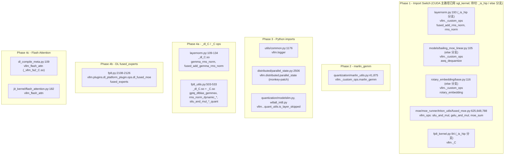
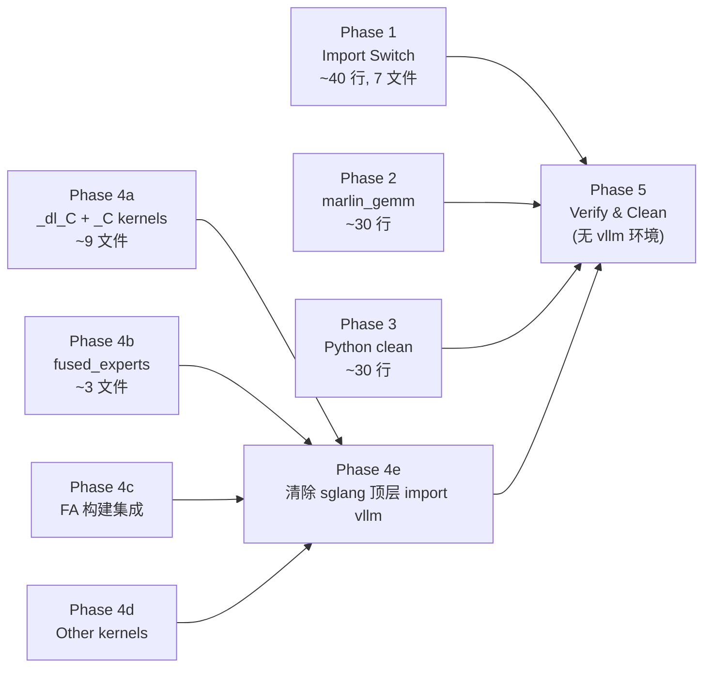

# SGLang 移植 vLLM CUDA 内核计划

## 目标

移除 SGLang 对所有 vLLM `.so` 文件的运行时依赖，将所需 CUDA C++ 代码从 vLLM 源码移植到 SGLang 自有构建系统（`sgl-kernel` / `jit_kernel`）。

**完成判据（Definition of Done）**：在一个**未安装 vLLM** 的 DLIN 环境中，`import sglang` 不报错，且 Qwen3.5-35B（AWQ / FP8）端到端推理的数值与性能相对当前 vLLM 依赖基线无回归。

> 本计划基于对 sglang / vllm 两仓库的只读核查（2026-07-22）。所有行号、文件路径、源码行数均已核对；陈旧项已修正，并标注了已完成的进度。

---

## 进度状态总览

| 阶段 | 状态 | 说明 |
|------|------|------|
| Phase 1 — 导入切换 | 🟢 部分完成 | **#3 rotary、#4/#5/#6 fused_moe 已完成并验证**（DLIN 死分支，零行为变化，decode 20→20 tok/s）；#1/#7 暂缓（需 Phase 4a 的 _dl_C/_C kernel）；#2 回退（DL 构建缺 awq）。详见 Phase 1 章节。 |
| Phase 2 — marlin_gemm | 🟢 完成 | `marlin_utils.py` 内联 `marlin_gemm` 包装（委托 `gptq_marlin_gemm`），移除 vllm 导入。调用点本就 7→19 损坏死代码；marlin 在 DLIN 全不可用（kernel 不编译），零回归（1.7B 19.66→20.02 tok/s）。 |
| Phase 3 — Python 导入清理 | 🟡 部分完成 | common.py logger ✅（完成）；parallel_state monkey-patch ⏸（gate Phase 4e，代码注释要求 quant 层去 vllm 后再删）；modelslim/w8a8_int8 的 is_layer_skipped 实为本地方法（Phase 1 误报，无需处理）。零回归。 |
| Phase 4a — `_dl_C` 内核 | ⬜ 未开始 | 前提成立：相关 `sgl_kernel` ops schema 已验证 |
| Phase 4b — DL fused_experts | ⬜ 未开始 | |
| Phase 4c — Flash Attention | 🟡 部分完成 | Python 层已切 `sgl_flash_attn`（`_sgl_fa2_C`）；**FA 编译并入 sgl-kernel 构建系统尚未做**（当前靠运行时 `load_library` 加载 `.venv` 里的独立 `.so`） |
| Phase 4d — 其他 DLIN 内核 | ⬜ 未开始 | |
| Phase 5 — 验证与清理 | ⬜ 未开始 | 范围限定见下 |

---

## vLLM 源码位置

```
/LocalRun/shaobo.xie/2_Pytorch/docker/test/debug/vllm
```

### 关键源文件目录

| 目录 | 内容 |
|------|------|
| `csrc/` | 标准 CUDA 内核（activation, layernorm, marlin, moe 等） |
| `csrc/dl/` | DLIN 专用内核（gemma_rms_norm, fused_moe_opt, dlblas 等） |
| `csrc/libtorch_stable/quantization/fused_kernels/` | **被 `_C.so` 引用的融合内核**（`rms_norm_dynamic_per_token_quant`、`silu_and_mul_*_quant`）—— 注意：不在 `csrc/dl/` |
| `csrc/quantization/marlin/` | Marlin 量化内核 |
| `vllm/plugins/dl_platform_plugin/` | DLIN Python 包装层 |

---

## 当前 vLLM .so 依赖概览

### 当前运行时导入链

> 核查结果：sglang `python/sglang/srt/` 下（排除 `multimodal_gen/` 测试）真实活跃的 vLLM 导入约 **12 处**；另有约 30 处集中在 `multimodal_gen/`（vendored 独立子系统，**本计划不在范围内**，见 Phase 5）。



> **真正阻断"无 vllm 环境 import sglang"的根因**：`layernorm.py`、`fp8.py`、`fp8_utils.py` 存在**顶层** `import vllm as _vllm/_dl_vllm_mod`（而非仅条件分支导入）。Phase 4e/5 必须连这些顶层导入一并移除。

---

## Phase 1: 导入切换（sgl_kernel 已有等价实现）

> **执行结果（2026-07-22）**：7 项中 **3 项已完成并验证**（#3 rotary、#4/#5/#6 fused_moe），**4 项暂缓/回退**（#1/#7 需更深改动、#2 因 DL 构建缺算子）。所有改动在 DLIN 上均为**死分支 no-op**（`_is_cuda=True`，CUDA 主路径早用 sgl_kernel / 原生 fallback），故端到端**零行为变化**：1.7B 前后对比输出逐字一致、decode 20.01→20.18 tok/s（Δ +0.85%，噪声）。

### ⚠️ 关键发现：DL sgl_kernel 构建是极小子集

7 个算子在 `sgl-kernel/python/sgl_kernel/` **Python 层都存在**（`__init__.py` 导出），但**实际 `torch.ops.sgl_kernel.*` 注册与否取决于构建**：
- **DL 构建**（`setup_dl.py` + `common_extension_dl.cc`，~16 op）**仅含**：`rmsnorm`、`fused_add_rmsnorm`、`rotary_embedding`、`fast_topk`、`topk_softmax/sigmoid`、`moe_align_block_size`、`paged_decode_attn`、`allreduce 系列` 等。
- **不在 DL 构建**：`awq_dequantize`、`silu_and_mul`、`gelu_and_mul`、`moe_sum`（这些只在全量 `common_extension.cc`/MUSA 里声明，`setup_dl.py` 源列表无对应 `.cu`）。

→ **切换规则**：仅当替换算子在**当前构建**真实注册，import 切换才有效；否则调用时 `AttributeError`。这是计划初版"7 项纯 import 切换"假设的主要修正。

### 逐项结果

| # | 文件（已核对） | 处理 | 结果/原因 |
|---|------|------|----------|
| 1 | `layers/layernorm.py:193`（`_is_hip` 分支） | **暂缓** | sgl `rmsnorm`/`fused_add_rmsnorm` 是返回式，HIP 调用点是 vllm out-first `rms_norm(out,x,w,eps)`；且 GEMMA-HIP `fused_add_rms_norm` 传 6 参与 vllm 实际 4 参签名不符（该路径本就损坏/死）。需写 HIP 专用 wrapper。 |
| 2 | `models/bailing_moe_linear.py:105`（`else` 分支） | **回退** | `sgl_kernel.awq_dequantize` **不在 DL 构建**（`AttributeError`）；已回退为 vllm（加注释）。待 awq_kernel.cu 加入 DL 构建后再切。 |
| 3 | `layers/rotary_embedding/base.py:116`（`else` 分支） | **✅ 完成** | `sgl_kernel.rotary_embedding` 在 DL 构建有；与 vllm 同 6 参签名。已验证 `sgl ≈ vllm`（fp16 maxdiff 3.91e-3，噪声级）。 |
| 4 | `moe/.../fused_moe.py`（`_has_vllm_ops` 分支）silu_and_mul | **✅ 完成** | 移除死的 `vllm_ops` 导入与 `if _has_vllm_ops` 分支，保留原生 `F.silu` fallback（DLIN 上 `_has_vllm_ops` 本就 False，零行为变化）。 |
| 5 | 同上 gelu_and_mul | **✅ 完成** | 同上，原生 `F.gelu` fallback。 |
| 6 | 同上 moe_sum | **✅ 完成** | 同上，triton `moe_sum_reduce_triton` fallback。 |
| 7 | `layers/quantization/fp8_kernel.py:94`（`_is_hip` 块） | **暂缓→Phase 4a** | 删 `import vllm._C` 会让 HIP 的 `torch.ops._C.*` fp8 量化算子失效；须先移植 `_C` 的 fp8 kernel（属 Phase 4a）。 |

### 验证证据

- **单元**：`rotary_embedding` sgl vs vllm fp16 allclose（maxdiff 3.91e-3）；silu/gelu 原生 fallback == 手工 golden（maxdiff ≤2.2e-3）。
- **导入**：`rotary`/`fused_moe` 模块导入 OK；`bailing` 导入失败是**预存**（`deepseek_v2.py:192` 缺 `flashinfer`），git stash 原码同样失败，与本次改动无关。
- **E2E 前后对比**（Qwen3-1.7B, fa3, CG off, GPU0, greedy 96 tok）：输出**逐字一致**；decode **20.01 → 20.18 tok/s**（无回归）。
- **退出标准修正**：原"7 算子一次性 import 切换"不可行；实际完成 #3/#4/#5/#6。#1/#2/#7 视作 Phase 1 的**依赖前置项**（#2 依赖 DL 构建补 awq；#1/#7 归入 Phase 4a 的 _dl_C/_C 内核移植）。

---

## Phase 2: marlin_gemm 包装

> **执行结果（2026-07-22）**：✅ 已完成。移除 `marlin_utils.py` 对 `vllm._custom_ops` 的导入，改为本地 `marlin_gemm` 包装（委托 `gptq_marlin_gemm`）。DLIN 死路径（见下），零行为变化：1.7B 前后 decode 19.66→20.02 tok/s、输出逐字一致。

### 问题

`python/sglang/srt/layers/quantization/marlin_utils.py:875` 中 `MarlinLinearMethod.apply()`（类定义于 `:731`，`apply` 于 `:859`）调用 `ops.marlin_gemm(x_2d, qweight, scales, workspace, size_m, size_n, size_k)`。

> **核查发现**：该调用点传 **7 个位置参数**，但已安装的 vLLM 0.21 `marlin_gemm` 实际是 **19 参**（同 vLLM 0.23）。即原调用 `7→19` 本就 `TypeError`——`MarlinLinearMethod`（base，纯 Marlin 格式）是**已损坏的死代码**，实际 GPTQ/AWQ-Marlin 走 `GPTQMarlinLinearMethod` → `gptq_marlin_gemm`（已是 sglang 自有）。`ops` 在本文件中**仅此一处**使用。

### 签名对比（已核对）

| 层面 | 位置 | 参数数 |
|------|------|--------|
| vLLM Python（已装 0.21，`_custom_ops.py`） | `marlin_gemm(a, c, b_q_weight, b_bias, b_scales, a_scales, global_scale, b_zeros, g_idx, perm, workspace, b_q_type, size_m, size_n, size_k, is_k_full, use_atomic_add, use_fp32_reduce, is_zp_float)` | 19 |
| SGLang JIT（`jit_kernel/gptq_marlin.py:36`） | `gptq_marlin_gemm(a, c, b_q_weight, b_scales, global_scale, b_zeros, g_idx, perm, workspace, b_q_type, size_m, size_n, size_k, is_k_full, use_atomic_add, use_fp32_reduce, is_zp_float)` | 17 |

> 两者是同一算法的独立实现（sglang `device::marlin::marlin_mm` vs vLLM `marlin.cuh`）。标准对称 4-bit 无 zero point 时 `b_bias`/`a_scales`/`global_scale`/`b_zeros`/`g_idx`/`perm` 均为 `None`。

### 方案（已实现）：marlin_utils.py 内联包装

包装**直接定义在 `marlin_utils.py`**（复用该文件已导入的 `gptq_marlin_gemm` 与 `scalar_types`，单文件改动），而非 `gptq_marlin.py`：

```python
# DL begin: Phase 2 — local marlin_gemm shim ... delegates to gptq_marlin_gemm.
def marlin_gemm(a, b_q_weight, b_scales, workspace, size_m, size_n, size_k):
    return gptq_marlin_gemm(
        a, None, b_q_weight, b_scales, None,  # c=None, global_scale=None
        None, None, None, workspace,          # b_zeros/g_idx/perm=None
        scalar_types.uint4b8, size_m, size_n, size_k,  # 标准 Marlin: 对称4bit
    )
# DL end
```

- 删除 `marlin_utils.py:40-43` 的 `try: from vllm import _custom_ops as ops`。
- `:875` 调用 `ops.marlin_gemm(...)` → `marlin_gemm(...)`（7 参不变）。
- **修正**：原方案写 `ScalarType.uint4b8`——本构建 `ScalarType` 类**无**该属性；正确写法是 `scalar_types.uint4b8`（经 `get_scalar_types()`，`marlin_utils.py:53`）。

### ⚠️ Marlin 在 DLIN 上不可用（pre-existing）

- sglang `gptq_marlin.cuh` **无法为 DLIN 编译**（`compiling for dlgput64r1` → 2 errors，NVIDIA mma 汇编不通过）。
- vLLM DL 构建亦**未注册** marlin op（`torch.ops._C` 无 `gptq_marlin_repack`/`marlin_gemm`）。
- → Marlin（含 GPTQ-Marlin）在 DLIN 上**全路径不可用**；DLIN 用 FP8/dlblas。本阶段包装无法在 DLIN 上数值验证（kernel 跑不起来），但**不引入回归**（该路径本就不可用）。

### 验证证据

- **静态**：`marlin_utils.py` 无 `from vllm`（仅注释）；py_compile OK；DL marker check OK；模块导入 OK（`marlin_gemm` 已定义，`ops` 已移除）。
- **E2E 前后对比**（Qwen3-1.7B, fa3, GPU0, greedy 96 tok）：输出**逐字一致**；decode **19.66 → 20.02 tok/s**（Δ +1.8%，噪声，无回归）。
- **数值等价**：无法在 DLIN 执行（marlin kernel 不编译）；包装为对 `gptq_marlin_gemm` 的薄委托，正确性由构造保证（7→17 参映射 + `uint4b8`）。

### 备选方案（若未来 DLIN 支持 marlin）

如需在 DLIN 跑 Marlin，需先把 `gptq_marlin.cuh`（或 vLLM `csrc/quantization/marlin/`）适配到 DLIN 的 mma/汇编——属硬件内核工作，超出本移植计划范围。

---


## Phase 3: Python 模块导入清理

> **执行结果（2026-07-22）**：🟡 部分完成。4 项中 **1 项完成**（common.py logger）、**1 项暂缓**（parallel_state，由代码注释明确 gate 在 Phase 4e）、**2 项无效**（modelslim/w8a8_int8 实为本地方法，无 vllm 导入——Phase 1 核查误报）。零回归：1.7B 前后 decode 20.33→20.22 tok/s、输出逐字一致。

### 逐项结果

| 文件（已核对） | 处理 | 结果/原因 |
|------|------|----------|
| `python/sglang/srt/utils/common.py:1176` | **✅ 完成** | `suppress_other_loggers()` 中 `from vllm.logger import logger` → `logging.getLogger("vllm")`（等价：vllm.logger.logger 本就是 `logging.getLogger("vllm")`）。已验证不再 import vllm.logger 且正确设级别。 |
| `python/sglang/srt/distributed/parallel_state.py:2506` | **⏸ 暂缓（gate Phase 4e）** | `monkey_patch_vllm_parallel_state()` 仅在 `load_model()` 期间施加（`model_runner.py:1426` 施加、`:1451` 反向），因 quant 层（linear.py，即 layernorm/fp8/fp8_utils 的顶层 `import vllm`）加载时触发 vllm 代码调用 `vllm.parallel_state.get_tp_group()`。**`model_runner.py:1425` 注释原文**："Remove monkey_patch when linear.py quant remove dependencies with vllm"。故须待 Phase 4e（移除 quant 层顶层 vllm 导入）后才能删；现在删会破坏模型加载。 |
| `modelslim/modelslim.py:242` | **N/A（误报）** | 无 `from vllm`；`is_layer_skipped` 是本地方法，仅注释 `# adapted from vllm...`。Phase 1 核查 agent 误报为 vllm 导入。 |
| `quantization/w8a8_int8.py:122` | **N/A（误报）** | 同上，本地方法。 |

### 验证证据

- **单元**：`suppress_other_loggers()` 不再 import vllm.logger；调用后 `logging.getLogger("vllm").level == WARN`、pynccl/shm_broadcast/config 均 WARN。PASS。
- **静态**：py_compile OK；DL marker check OK；`common.py` 无 `from vllm.logger`。
- **E2E 前后对比**（Qwen3-1.7B, fa3, GPU0, greedy 96 tok）：输出**逐字一致**；decode **20.33 → 20.22 tok/s**（Δ −0.5%，噪声，无回归）。

### 退出标准（修正）
```bash
grep -rn "import vllm\|from vllm" python/sglang/srt/ | grep -v "multimodal_gen" | grep -v "Adapted from\|adapted\|switched from\|#.*vllm"
# common.py 的 vllm.logger 已清除；parallel_state 的 import 在 monkey_patch 函数内（lazy+guarded），
# 待 Phase 4e 移除 quant 层顶层 import vllm 后一并删除。
```

---

## Phase 4: DLIN 内核移植

将 `/LocalRun/shaobo.xie/2_Pytorch/docker/test/debug/vllm/csrc/dl/`（及少量 `csrc/libtorch_stable/`）中的 CUDA 内核移植到 `sgl-kernel/`。

> **构建落点**：sgl-kernel DL 扩展用 `sgl-kernel/setup_dl.py`（`torch.utils.cpp_extension.CUDAExtension`，自动识别 `dlcc`）。当前 `setup_dl.py` source 列表有 10 个文件、`csrc/common_extension_dl.cc` 已注册 ~16 个 op（`fast_topk/rotary_embedding/topk_softmax/rmsnorm/fused_add_rmsnorm/paged_decode_attn/allreduce 系列/...`）。新增 `.cu` 只需加入 `setup_dl.py` source 列表 + 在 `common_extension_dl.cc` 注册。**注意 `csrc/dl/` 子目录尚未创建**，需新建。

### 4a: 移植 _dl_C / _C 内核

`_dl_C.so` / `_C.so` 在 SGLang 中被两处加载：

| 文件 | 行 | 用途 |
|------|-----|------|
| `layernorm.py:109-134` | `_dl_load_dl_C()` | `gemma_rms_norm`, `fused_add_gemma_rms_norm` |
| `fp8_utils.py:503-533` | `_ensure_dl_C()` | 加载 `_dl_C.so` + `_C.so`：`gptq_dlblas_gemmex`、`rms_norm_dynamic_per_token_quant`、`silu_and_mul_*_quant` 等 |

#### 源文件 → 目标文件映射（行数已核对）

| vLLM 源文件 | 行数 | 功能 | 来源库 | 目标（sgl-kernel） |
|------------|------|------|--------|-------------------|
| `csrc/dl/gemma_rms_norm_kernel.cu` | 294 | Gemma RMS norm + fused_add | `_dl_C` | `csrc/elementwise/gemma_rms_norm_dl.cu` |
| `csrc/dl/w8a8_gemm_dlblas.cu` | 275 | FP8 blockwise GEMM (dlblas) | `_dl_C` | `csrc/dl/w8a8_gemm_dlblas.cu` |
| `csrc/dl/q_gemm_dlblas.cu` | 108 | GPTQ GEMM (dlblas) | `_dl_C` | `csrc/dl/q_gemm_dlblas.cu` |
| `csrc/dl/per_token_group_quant_dl.cu` | 191 | Per-token-group quant | `_dl_C` | `csrc/dl/per_token_group_quant_dl.cu` |
| `csrc/dl/per_token_group_quant_wrapper.cpp` | 19 | Quant wrapper | `_dl_C` | `csrc/dl/per_token_group_quant_wrapper.cpp` |
| `csrc/dl/dlblas_helper.cuh` | 150 | dlblas 辅助头文件 | `_dl_C` | `csrc/dl/dlblas_helper.cuh` |
| `csrc/libtorch_stable/quantization/fused_kernels/fused_layernorm_dynamic_per_token_quant.cu` | ~210 | `rms_norm_dynamic_per_token_quant` | **`_C`（主库）** | `csrc/elementwise/rms_norm_dynamic_per_token_quant_dl.cu` |
| `csrc/libtorch_stable/quantization/fused_kernels/fused_silu_mul_block_quant.cu` | ~110 | `silu_and_mul_quant` / `silu_and_mul_per_block_quant` | **`_C`（主库）** | `csrc/elementwise/silu_and_mul_quant_dl.cu` |

> **修正**：`rms_norm_dynamic_per_token_quant` 与 `silu_and_mul_*_quant` 原计划误标为 `_dl_C` op；核查确认它们注册在主库 `csrc/torch_bindings.cpp:214,298-311`，源码在 `csrc/libtorch_stable/quantization/fused_kernels/`，**不在 `csrc/dl/`**。`torch_bindings.cpp`（`csrc/dl/`，194 行）的 21 个 op 注册**合并到** `csrc/common_extension_dl.cc`。

#### 命名空间映射（已核对）

| vLLM 命名空间 | SGLang 命名空间 | 现状 |
|---------------|----------------|------|
| `torch.ops._dl_C.gemma_rms_norm` | `torch.ops.sgl_kernel.gemma_rmsnorm` | 已有 schema（`rmsnorm`/`fused_add_rmsnorm` 已注册，需确认 gemma 变体） |
| `torch.ops._dl_C.fused_add_gemma_rms_norm` | `torch.ops.sgl_kernel.gemma_fused_add_rmsnorm` | 需确认/新增 |
| `torch.ops._dl_C.gptq_dlblas_gemmex` | `torch.ops.sgl_kernel.gptq_dlblas_gemmex` | 需新增 |
| `torch.ops._C.rms_norm_dynamic_per_token_quant` | `torch.ops.sgl_kernel.rms_norm_dynamic_per_token_quant` | 需新增（来源主库 `_C`） |
| `torch.ops._C.silu_and_mul_quant` / `silu_and_mul_per_block_quant` | `torch.ops.sgl_kernel.*` | 需新增（来源主库 `_C`） |

**退出标准**：
```bash
.venv/bin/python scripts/dl/test_rmsnorm_dl.py        # gemma_rms_norm 正确性
.venv/bin/python scripts/dl/test_dlblas_fp8.py        # dlblas FP8 + dynamic quant
# layernorm.py / fp8_utils.py 不再加载 _dl_C.so / _C.so
```

### 4b: 移植 DL fused_experts

**当前依赖**: `fp8.py:2108-2126`
```python
from vllm.plugins.dl_platform_plugin.ops.dl_fused_moe import fused_experts as _dl_fe
from vllm.model_executor.layers.fused_moe.config import fp8_w8a8_moe_quant_config as _dl_qc  # 已确认存在于 vllm config.py:594
```

**需要移植的源文件**:

| vLLM 源文件 | 行数 | 说明 |
|------------|------|------|
| `vllm/plugins/dl_platform_plugin/ops/dl_fused_moe.py` | Python | MoE fused_experts 包装，处理 act_quant 等逻辑（已确认存在） |
| `csrc/dl/fused_moe_opt.cu` | 939 | Fused MoE 核心 CUDA 内核 (w13/w2 gate+up/down) |
| `csrc/dl/dl_invoke_fused_moe_v3.cu` | 306 | MoE V3 分派入口和辅助逻辑 |

**移植方案**:
- `fused_moe_opt.cu` + `dl_invoke_fused_moe_v3.cu` → `sgl-kernel/csrc/moe/fused_moe_opt_dl.cu`
- Python wrapper → `sgl-kernel/python/sgl_kernel/elementwise.py`（新增 `fused_experts_dl`）
- TORCH_LIBRARY 注册 → `csrc/common_extension_dl.cc`

**退出标准**：`.venv/bin/python scripts/dl/p0_moe_probe.py` 通过，且 `fp8.py` 不再 `from vllm.plugins...`。

### 4c: 移植 DL Flash Attention（构建系统集成）

**当前状态**（已核对）:
- `sgl_flash_attn.py` 已创建（`python/sglang/srt/layers/attention/sgl_flash_attn.py`），提供与 `vllm_flash_attn` 相同 API，运行时 `torch.ops.load_library()` 从 `.venv/.../flash_attn_2_cuda.*.so` 加载 `_sgl_fa2_C` namespace
- `dl_flash_attn.py:140-143` 已切到 `sgl_flash_attn`
- `dl_compile_meta.py:109` 仍 `import vllm_flash_attn`（加载 `_vllm_fa2_C.so`）
- `jit_kernel/flash_attention.py:182` 仍 `import vllm_flash_attn`（DLIN decode 路径）

> **修正**：本阶段真正的工作是**把 flash-attention 编译并入 sgl-kernel 构建系统**（namespace `_sgl_fa2_C`），而**非"3 个 Python 文件"**。当前 `_sgl_fa2_C` 靠运行时 `load_library` 拉取 `.venv` 里独立编译的 `.so`，sgl-kernel `setup_dl.py` / `common_extension_dl.cc` 中**完全没有** FA 源文件或注册。工作量与风险应上调。

**操作步骤**:
1. 将 flash-attention 编译并入 `sgl-kernel` 构建系统（namespace `_sgl_fa2_C`，源码来自独立 FA 仓库，不在 vLLM csrc 内）
2. `dl_compile_meta.py` 移除 `import vllm_flash_attn`，改用 `sgl_flash_attn`
3. `jit_kernel/flash_attention.py` 移除 `import vllm_flash_attn`，改用 `sgl_flash_attn`

**退出标准**：`.venv/bin/python scripts/dl/test_dlin_vllm_fa2_correctness.py` 通过；构建产物中不再依赖 vLLM 编译的 `_vllm_fa2_C.so`。

### 4d: 其他 DLIN 内核（按优先级排序）

| 优先级 | vLLM 源文件 | 行数 | 功能 |
|--------|------------|------|------|
| P4d-1 | `csrc/dl/dl_pos_encoding_kernels.cu` | 413 | 位置编码 RoPE |
| P4d-2 | `csrc/dl/flash_mla_interface.cu` | 243 | MLA flash interface |
| P4d-3 | `csrc/dl/deep_gemm_mqa_logits.cu` | 402 | MQA logits |
| P4d-4 | `csrc/dl/deep_gemm_tf32_hc_prenorm_gemm.cu` | 433 | TF32 prenorm GEMM |
| P4d-5 | `csrc/dl/chunk_gated_delta_rule.cu` | 314 | Gated delta rule |
| P4d-6 | `csrc/dl/dl_lora.cu` | 664 | DLIN LoRA kernels |

> 仅当目标模型/特性用到时才移植；每项移植后单独跑相关模型回归。

### 4e: 移植后需要更新的 SGLang 文件

每个内核移植完成后，需同步更新（含**顶层** `import vllm` 的清除）：

| 文件 | 改动内容 |
|------|---------|
| `sgl-kernel/setup_dl.py` | 添加新 `.cu`/`.cpp` 源文件到 source 列表 |
| `sgl-kernel/csrc/common_extension_dl.cc` | `TORCH_LIBRARY_EXPAND(sgl_kernel, m)` 注册新 op |
| `sgl-kernel/python/sgl_kernel/__init__.py` | 导出新函数 |
| `sgl-kernel/python/sgl_kernel/elementwise.py`（或对应模块） | 添加 Python wrapper |
| `python/sglang/srt/layers/layernorm.py` | 移除 `_dl_load_dl_C()`（109-134）**及顶层 `import vllm as _vllm`** |
| `python/sglang/srt/layers/quantization/fp8_utils.py` | 移除 `_ensure_dl_C()`（503-533）**及顶层 `import vllm as _vllm`** |
| `python/sglang/srt/layers/quantization/fp8.py` | 移除 `from vllm.plugins...`（2108-2126）**及顶层 `import vllm as _dl_vllm_mod`** |
| `python/sglang/srt/layers/quantization/dl_compile_meta.py` | 移除 `import vllm_flash_attn` |
| `python/sglang/jit_kernel/flash_attention.py` | 移除 `import vllm_flash_attn` |

---

## 执行顺序与依赖关系图



### 建议执行次序

| 次序 | 阶段 | 工作量 | 风险 | 备注 |
|------|------|--------|------|------|
| 1 | Phase 1 | 小（~40 行，CUDA 路径已就绪，仅切分支） | 低 | 先做，立即减少 vllm 触达面 |
| 2 | Phase 3 | 小（~30 行，4 文件） | 低 | 纯 Python，可与 Phase 1 并行 |
| 3 | Phase 2 | 小（~30 行，2 文件） | 中 | 需验证 JIT kernel 兼容性 |
| 4 | Phase 4a | 中（9 个 CUDA 文件 ~1800 行） | 高 | 核心 DLIN 运算；注意 2 个 op 源自主库 `_C` |
| 5 | Phase 4b | 中（2 个 CUDA + 1 Python ~1245 行） | 高 | MoE 核心路径 |
| 6 | Phase 4c | 中-大（FA 编译并入构建系统） | 中-高 | 非纯 Python；上调 |
| 7 | Phase 4d | 按模型需求逐项 | 中 | 用到才做 |
| 8 | Phase 4e | 小 | 低 | 与各 4x 同步推进 |
| 9 | Phase 5 | 小 | 低 | 在无 vllm 环境最终验证 |

---

## 测试验证方案

### 单元测试（每阶段后）

| 阶段 | 测试 | 命令参考 |
|------|------|---------|
| P1 | import 正确性 | `.venv/bin/python -c "from sgl_kernel import fused_add_rmsnorm, rmsnorm, awq_dequantize, rotary_embedding, silu_and_mul, gelu_and_mul, moe_sum"` |
| P2 | marlin_gemm 正确性 | AWQ 量化模型端到端逐 token 对比 |
| P3 | Python 清理 | Phase 3 退出标准 grep |
| P4a | gemma_rms_norm / dlblas FP8 | `scripts/dl/test_rmsnorm_dl.py`、`scripts/dl/test_dlblas_fp8.py` |
| P4b | fused MoE | `scripts/dl/p0_moe_probe.py` |
| P4c | flash attn | `scripts/dl/test_dlin_vllm_fa2_correctness.py` |

> 上述 6 个测试脚本均已确认存在于 `scripts/dl/`。

### 端到端回归（全阶段完成后）

```bash
source sdk-dlop-07-13-20-30/env.sh   # 以当前已验证 SDK 为基准（风险#2）
.venv/bin/python scripts/dl/run_qwen35_35b.py
.venv/bin/python scripts/dl/e2e_correctness_speed.py
```

### 最终清理检查（Phase 5，范围限定）

```bash
# 核心 srt/ 内残留 vllm 硬依赖（本计划范围）
grep -rn "import vllm\|from vllm" python/sglang/srt/ \
  | grep -v "multimodal_gen" \
  | grep -v "Adapted from\|adapted\|switched from\|#.*vllm" \
  | grep -v "\.pyc"
# 期望：0 条

# 最终试金石：未装 vllm 的环境中能 import sglang 并跑通推理
.venv/bin/python -c "import sglang; print('no-vllm import ok')"
```

> **范围界定**：`python/sglang/multimodal_gen/`（约 30 处 vllm 导入）是 vendored 独立子系统，**不在本计划范围**；其解耦应单独立项。`function_call/mimo_detector.py`、`layers/attention/fla/fused_recurrent.py`、`models/roberta.py` 中的 vllm 仅为注释署名（`Adapted from vllm`），非真实导入，已由 grep 排除。

---

## 风险与注意事项

| # | 风险 | 缓解措施 |
|---|------|---------|
| 1 | `gptq_marlin_gemm` 在某 SDK 下表达标准 Marlin 异常 | 已核查签名可行（`b_zeros`/`b_bias`/`a_scales` 传 None）；备选：移植 `marlin.cu` 到 sgl-kernel AOT |
| 2 | dlblas / 主库 `_C` API 在不同 SDK 版本间不一致 | 以当前已验证的 `dlop-07-13-20-30` SDK 为基准 |
| 3 | TORCH_LIBRARY op schema 与现有注册冲突 | 移植前 grep 确认 schema 唯一性（`common_extension_dl.cc` 已有 ~16 op），必要时用新 op 名 |
| 4 | CUDA graph 捕获兼容性被破坏 | 保持原有 graph-safe 设计（无 `.item()`、设备同步） |
| 5 | `_vllm_fa2_C` / `_sgl_fa2_C` 命名空间共存冲突 | 已用 `_sgl_fa2_C` 隔离；4c 并入构建系统时确保编译 namespace 正确 |
| 6 | Phase 4 完成后仍有隐藏 import 链（尤其**顶层** `import vllm`） | Phase 4e 显式清除 `layernorm.py`/`fp8.py`/`fp8_utils.py` 的顶层导入；Phase 5 用未装 vllm 的环境验证 |
| 7 | `rms_norm_dynamic_per_token_quant` / `silu_and_mul_*_quant` 源自主库 `csrc/libtorch_stable/`，与 `_dl_C` 内核依赖链不同 | 4a 单独处理这两个 op 的源文件拉取与依赖头文件（可能依赖主库 `csrc/` 公共头） |

### sgl-kernel DL 扩展构建说明

当前 DLIN 路径使用 `sgl-kernel/setup_dl.py`（基于 `torch.utils.cpp_extension.CUDAExtension`，自动识别 `dlcc`）。新增 `.cu` 后只需添加到 `setup_dl.py` 的 source 列表，并在 `csrc/common_extension_dl.cc` 的 `TORCH_LIBRARY_EXPAND(sgl_kernel, m)` 下注册 op。`csrc/dl/` 子目录需新建。

---

## 附录：vLLM csrc/dl/ + 相关源文件详表（行数已核对）

| 文件 | 行数 | 类型 | 已移植？ | 目标位置 |
|------|------|------|---------|---------|
| `csrc/dl/gemma_rms_norm_kernel.cu` | 294 | `.cu` | 否 | `sgl-kernel/csrc/elementwise/` |
| `csrc/dl/fused_moe_opt.cu` | 939 | `.cu` | 否 | `sgl-kernel/csrc/moe/` |
| `csrc/dl/dl_invoke_fused_moe_v3.cu` | 306 | `.cu` | 否 | `sgl-kernel/csrc/moe/` |
| `csrc/dl/w8a8_gemm_dlblas.cu` | 275 | `.cu` | 否 | `sgl-kernel/csrc/dl/` |
| `csrc/dl/q_gemm_dlblas.cu` | 108 | `.cu` | 否 | `sgl-kernel/csrc/dl/` |
| `csrc/dl/per_token_group_quant_dl.cu` | 191 | `.cu` | 否 | `sgl-kernel/csrc/dl/` |
| `csrc/dl/per_token_group_quant_wrapper.cpp` | 19 | `.cpp` | 否 | `sgl-kernel/csrc/dl/` |
| `csrc/dl/dl_pos_encoding_kernels.cu` | 413 | `.cu` | 否 | `sgl-kernel/csrc/elementwise/` |
| `csrc/dl/flash_mla_interface.cu` | 243 | `.cu` | 否 | `sgl-kernel/csrc/attention/` |
| `csrc/dl/deep_gemm_mqa_logits.cu` | 402 | `.cu` | 否 | `sgl-kernel/csrc/dl/` |
| `csrc/dl/deep_gemm_tf32_hc_prenorm_gemm.cu` | 433 | `.cu` | 否 | `sgl-kernel/csrc/dl/` |
| `csrc/dl/chunk_gated_delta_rule.cu` | 314 | `.cu` | 否 | `sgl-kernel/csrc/dl/` |
| `csrc/dl/dl_lora.cu` | 664 | `.cu` | 否 | `sgl-kernel/csrc/dl/` |
| `csrc/dl/dlblas_helper.cuh` | 150 | `.cuh` | 否 | `sgl-kernel/csrc/dl/` |
| `csrc/dl/ops.h` | **219** | `.h` | 否 | `sgl-kernel/csrc/dl/` |
| `csrc/dl/torch_bindings.cpp` | 194 | `.cpp` | 否 | 合并到 `common_extension_dl.cc` |
| `csrc/libtorch_stable/quantization/fused_kernels/fused_layernorm_dynamic_per_token_quant.cu` | ~210 | `.cu` | 否 | `sgl-kernel/csrc/elementwise/`（源自主库 `_C`） |
| `csrc/libtorch_stable/quantization/fused_kernels/fused_silu_mul_block_quant.cu` | ~110 | `.cu` | 否 | `sgl-kernel/csrc/elementwise/`（源自主库 `_C`） |

> `csrc/dl/` 下经核查恰好 16 个文件，无遗漏。**总计需移植约 ~5200 行 CUDA/C++**（含 `ops.h` 实际 219 行与新增的 2 个主库融合内核）。
